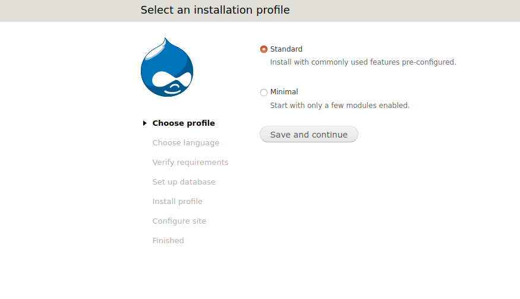

# Drupal 7 with Docker Compose

This is an example docker-compose setup that you might find useful if you
need to migrate an application on a production server to some kind of
development environment. This example folder provides a version 7.x
Drupal installation. If you want an example with Drupal 8, please see
[drupal-8](../drupal8/).

## Quick Start

 1. Copy your server (or other) drupal installation to [drupal](drupal). 
 2. Check for the correct version of drupal and the mysql database in the [Dockerfile](Dockerfile) and [Dockerfile.mysql](Dockerfile.mysql). You can look at container tags for each of [drupal](https://hub.docker.com/_/drupal/?tab=tags) and [mysql](https://hub.docker.com/_/mysql/?tab=tags).
 3. Update the secrets in the [.env](.env) file (normally don't add this to a repository!) to match your existing database. You can set them to some new values if you are starting fresh.
 4. `docker-compose build`
 5. `docker-compose up -d` to bring up containers
 6. For new installs, open the browser to [http://127.0.0.1](http://127.0.0.1) to enter database information. For existing databases, follow the instructions under [database import](#database-import) to import your previous database.

If you want to skip mounting and just run the containers with the provided (empty) base, then comment out all of the `COPY` lines 
from the [Dockerfile](Dockerfile). The base containers for drupal already have content here. If you want
to use a different database backend, you can also update the container base (and any environment variables
that are needed for the base that you choose). For most applications, you'll likely need to disable modules
via the command line, and you should continue reading for instructions how to do that.

## Container Orchestration

The [docker-compose.yml](docker-compose.yml) file serves as an orchestration
configuration to define two containers - one for the drupal instance (drupal)
and the second for a mysql database (database). We can take a look at the file to see how
it's setup:

```yaml
version: '3.3'

services:
  drupal:
    build: .
    ports:
      - 80:80
    restart: always

  database:
    build:
      context: .
      dockerfile: Dockerfile.mysql
    env_file:
     - ./.env
    volumes:
        - ./mysql/my.cnf:/etc/mysql/my.cnf
    ports:
      - "3306:3306"
    restart: always
```

Notice that we are only exposing port 80 on localhost, so this development
setup is not going to serve SSL (you could add port 443 if you want to set this
up). Also notice that the database container is mounting a configuration
[file for mysql](mysql/my.cnf). If you take a look at this file, it basically
increases timeouts so that if you have a large amount of data to import from
a database export, your connection will persist:

```
[mysqld]
skip-host-cache
skip-name-resolve
wait_timeout = 28800
innodb_log_file_size = 12800
datadir = /var/lib/mysql
max_allowed_packet = 64M
!includedir /etc/mysql/conf.d/
```

## Versions

If you are migrating something from an existing drupal install, versions are
very important! If you take a look at the [Dockerfile](Dockerfile) (builds drupal)
and [Dockerfile.mysql](Dockerfile.mysql) (database) these use base images with
very specific tags for each of [drupal](https://hub.docker.com/_/drupal/?tab=tags) 
and [mysql](https://hub.docker.com/_/mysql/?tab=tags). For example, to find the
version of mysql on your server you could do:

```
$ mysql -V
mysql  Ver 14.14 Distrib 5.5.54, for Linux (x86_64) using readline 5.1
```

And drupal version can be found in the CHANGELOG.txt of your installation.

## Copying Files

You can use scp (or another file transfer tool) to copy files from the server to your host machine.
For some installs, you will find the content at `/var/www/html`, however this can
vary depending on the web root for your server. You _could_ copy all of the content
in this folder, but really all that you need are these subfolders:

```
/var/www/html/modules   # copies to drupal/modules
/var/www/html/profiles  #           drupal/profiles
/var/www/html/themes    #           drupal/themes
/var/www/html/sites     #           drupal/sites
```

The rest of the drupal install can be provided by a base container. If you
have a database defined in sites to be on localhost (or some other server)
you'll need to update this to be hostname `database`:

```
I found issues only after adding the `/var/www/html/sites` so I suspected
there was a configuration that needed to be updated there. I found a `sites/default/settings.php`
file that had the correct database credentials, but the wrong hostname (localhost)
when it should have been the other container (hostname database):

```javascript
$databases = array (
  'default' => 
  array (
    'default' => 
    array (
      'database' => 'thedatabase',
      'username' => 'theuser',
      'password' => 'thepassword',
      'host' => 'database', # used to be localhost
      'port' => '',
      'driver' => 'mysql',
      'prefix' => '',
    ),
  ),
);
```


## Database Export

You'll likely need to export a dump of the database from your installation.
If you don't want to import anything, comment out the copy line for the sql
file in [Dockerfile.mysql](Dockerfile.mysql). Here is how to export from
 your current database:

```
mysqldump -u USERNAME -p'PASSWORD' DATABASENAME > $HOME/dump.sql
```

And then you would scp (or otherwise copy) this file to the root here.
In the example provided, I dumped a dummy example that was generated
with the same container.


## Container Builds

Once you have exported your database, and any folders from your production
server into [drupal](drupal) it's time to build your containers!

```bash
docker-compose build
```

And then bring them up

```bash
docker-compose up -d
```

## Database Import

Once your containers are running and you have build them with your
database dump and drupal folders added, you need to shell into
the database container and do the import.

```bash
docker exec -it biobank_database_1 bash
mysql -u $MYSQL_USER -p ${MYSQL_DATABASE} --password=${MYSQL_PASSWORD} < /dump.sql # >
```

The environment variables from your .env file should already be defined in the container.
If you aren't familiar with the command above, we are providing the username, database, and password
to a command to import the sql. To execute sql directly from the command line, you
can do:

```bash
mysql -u $MYSQL_USER -p ${MYSQL_DATABASE} --password=${MYSQL_PASSWORD} --execute="SELECT name from users where uid='1';"
+-------+
| name  |
+-------+
| admin |
+-------+
```

## Database Queries

It's likely the case that you might need to enable some set of modules to even see the login
screen. For example, if your site uses webauth or similar SAML authentication, these modules
need to be disabled because they won't work without https. You can do this in an interactive
database session:

```mysql
mysql -u $MYSQL_USER -p ${MYSQL_DATABASE} --password=${MYSQL_PASSWORD}
Reading table information for completion of table and column names
You can turn off this feature to get a quicker startup with -A

Welcome to the MySQL monitor.  Commands end with ; or \g.
Your MySQL connection id is 5
Server version: 5.5.54 MySQL Community Server (GPL)

Copyright (c) 2000, 2016, Oracle and/or its affiliates. All rights reserved.

Oracle is a registered trademark of Oracle Corporation and/or its
affiliates. Other names may be trademarks of their respective
owners.

Type 'help;' or '\h' for help. Type '\c' to clear the current input statement.

mysql> 
```

### Disabling Modules

Here is an example of how to disable a webauth or other modules. Note that we are
also clearing the cache.

```bash
docker exec -it drupal7_database_1 bash

# Disable a module (setting 1 to 0)

# This first change is for an older dump, 2017
UPDATE system SET status='0' WHERE name='webauth';
DELETE FROM cache_bootstrap WHERE cid='system_list'";

# This second change is for some newer version (2020) with SAML.
UPDATE system SET status='0' WHERE name='stanford_saml_block';
UPDATE system SET status='0' WHERE name='stanford_ssp';
UPDATE system SET status='0' WHERE name='stanford_simplesamlphp_auth';
DELETE FROM cache_bootstrap WHERE cid='system_list';
```

The specific modules that you disable will likely vary based on your particular
Drupal setup. The examples above were for authentication for Stanford apps.


### Creating a new User

You aren't going to easily have a user or super user account to develop with.
What is easiest to do is create a user in the interface, and then set the status
to 1 (to indicate active)

```mysql
UPDATE users SET status='1' WHERE name='pancakes';
```

I found there were a lot of issues with caching, here is how to clear caches.

```bash
# within mysql
TRUNCATE TABLE cache;
TRUNCATE TABLE cache_block;
TRUNCATE TABLE cache_bootstrap;
TRUNCATE TABLE cache_field;
TRUNCATE TABLE cache_filter;
TRUNCATE TABLE cache_form;
TRUNCATE TABLE cache_image;
TRUNCATE TABLE cache_menu;
TRUNCATE TABLE cache_page;
TRUNCATE TABLE cache_path;
TRUNCATE TABLE cache_token;
TRUNCATE TABLE cache_update;
```

To set a password you need to shell into the drupal container and interact with
one of the scripts to generate a correct hash:

```bash
docker exec -it drupal7_drupal_1 bash
root@842907607a12:/var/www/html# ./scripts/password-hash.sh newpass 

password: newpass 		hash: $S$D3NAUBfR4qsL57HEqouQ2w1zRFgnvo9.PemStB3K3i.dfd6cnmD2
```
And then use that hash to update the database (again in the database container)

```sql
UPDATE users SET pass = '$S$D3NAUBfR4qsL57HEqouQ2w1zRFgnvo9.PemStB3K3i.dfd6cnmD2' where name = 'pancakes';
```

You should then be able to log in! You can do this for any user account, or
even an admin account. It's nice to have access to both for testing.

### Useful Queries

For any of the below, you need to exec into the database container, and then run an sql command with `--execute`
or just in an interactive mysql shell. I found these to be useful.

```sql
# See all modules installed
SELECT name,status FROM system WHERE type='module';

# See enabled modules
SELECT name,status FROM system WHERE type='module' and status="1";

# Disable a module (setting 1 to 0)
UPDATE system SET status='0' WHERE name='webauth';
```

At this point, you should have a working, running Drupal 7 instance, develop
away, friend! If you have the drupal folders mounted locally, you should be able
to make changes and then restart the containers to propogate:

```bash
docker-compose restart
```

## Development

In order to create a dummy site (I wasn't going to use the actual site
I was developing for) I first build the containers as is, but commented
out the lines to copy anything from drupal (it was empty) in the Dockerfile,
and the copy in the Dockerfile.mysql.

```bash
$ docker-compose build

Building drupal
Step 1/1 : FROM drupal:7.58
 ---> bcfc420a21a7

Successfully built bcfc420a21a7
Successfully tagged drupal7_drupal:latest
Building database
Step 1/1 : FROM mysql:5.5.54
 ---> 9913483658d3

Successfully built 9913483658d3
Successfully tagged drupal7_database:latest
```

I could then bring up containers:

```bash
$ docker-compose up -d
Creating network "drupal7_default" with the default driver
Creating drupal7_drupal_1   ... done
Creating drupal7_database_1 ... done
```

I could then navigate to my [localhost](127.0.0.1) to see a dummy install!



At this point I could enter the username, password, and database information
and customize a random Drupal install. If you are creating a new database, you
*must* click on advanced and change the host from localhost to `database`.
Then you can see the empty install:


Once I configured the database, I added a basic starting page, and that's it. At this point I shelled into the
container to create a database export:

```bash
docker exec -it drupal7_database_1 bash
mysqldump -u theuser -p'thepassword' thedatabase > /dump.sql
```

I could then copy the drupal database dump and folders (if desired).

```bash
docker cp drupal7_database_1:/dump.sql dump.sql

# Note that since I didn't change the base container, I don't need to do this
docker cp drupal7_drupal_1:/var/www/html/modules drupal/modules
docker cp drupal7_drupal_1:/var/www/html/profiles drupal/profiles
docker cp drupal7_drupal_1:/var/www/html/themes drupal/themes
docker cp drupal7_drupal_1:/var/www/html/sites drupal/sites
```

That's it! If you have any questions, I'm a Drupal noob, but please [open an issue](https://github.com/vsoch/drupal-docker-compose)
anyway because maybe we can figure it out :)
